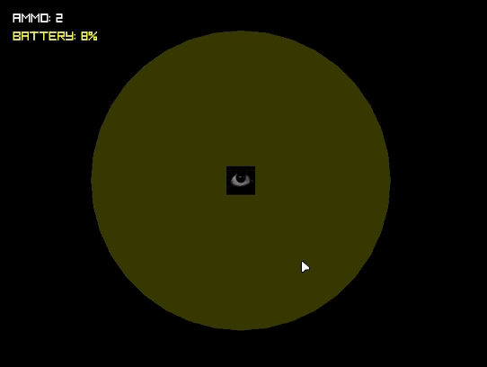

## 👁️ WATCHER SURVIVAL v1.0

You are locked in a dark security bunker, and **SOMETHING** is hunting you from the shadows. This is a hardcore tactical analog horror game.



### 💀 Hardcore Features
* **The Mimic Trap:** Supply boxes dynamically respawn, but watch out! There is a 30% chance a box turns into a Mimic Trap that destroys your battery and triggers a jumpscare.
* **FNAF-style Camera Navigation:** Turn left to the Electrical Room or right to the Ammo Storage using `A` and `D`.
* **Atmospheric Audio:** Features the legendary *Pikmin 2 - Submerged Castle* OST and immersive positional sound effects.

---

## 🛠️ How to Play

### 🐧 For Linux (Arch Linux)
Install Raylib dependencies:
```bash
sudo pacman -S raylib
```
Compile and run the code:
```bash
g++ watcher.cpp -o watcher -lraylib
./watcher
```

### 🪟 For Windows
1. Go to the **Releases** section on the right.
2. Download `horror_survival.zip`.
3. Unzip the **ENTIRE** archive into one folder.
4. Run `horror.exe`.
5. *Look behind you.* 😉
